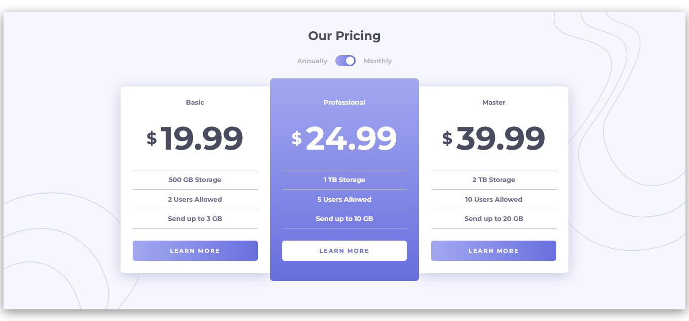

# Frontend Mentor - Pricing component with toggle solution

This is a solution to the [Pricing component with toggle challenge on Frontend Mentor](https://www.frontendmentor.io/challenges/pricing-component-with-toggle-8vPwRMIC). Frontend Mentor challenges help you improve your coding skills by building realistic projects. 

## Table of contents

- [Overview](#overview)
  - [The challenge](#the-challenge)
  - [Screenshot](#screenshot)
  - [Links](#links)
- [My process](#my-process)
  - [Built with](#built-with)
  - [What I learned](#what-i-learned)
- [Author](#author)

**Note: Delete this note and update the table of contents based on what sections you keep.**

## Overview

### The challenge

Users should be able to:

- View the optimal layout for the component depending on their device's screen size
- Control the toggle with both their mouse/trackpad and their keyboard
- **Bonus**: Complete the challenge with just HTML and CSS

### Screenshot




## My process

I use html5 css3 and Javascript for the project. First i made the html, next the css and the Javascript.
This project wasn't difficult. It's a good project for a beginner who want to practice Js smoothly on a real front-end project.

### Built with

- Semantic HTML5 markup
- CSS 
- Flexbox
- Responsive design
- Javascript 

### What I learned

I learned tabindex and praticed a little more localStorage. 

To see how you can add code snippets, see below:

```html
<div id="toggle" tabindex="0"><div id="circle"></div></div>
```

If you want more help with writing markdown, we'd recommend checking out [The Markdown Guide](https://www.markdownguide.org/) to learn more.


## Author

- Website - [Add your name here](https://www.your-site.com)
- Frontend Mentor - [@BlackSun225](https://www.frontendmentor.io/profile/BlackSun225)
- Twitter - [@yourusername](https://www.twitter.com/yourusername)

## Acknowledgments

This is where you can give a hat tip to anyone who helped you out on this project. Perhaps you worked in a team or got some inspiration from someone else's solution. This is the perfect place to give them some credit.

**Note: Delete this note and edit this section's content as necessary. If you completed this challenge by yourself, feel free to delete this section entirely.**
